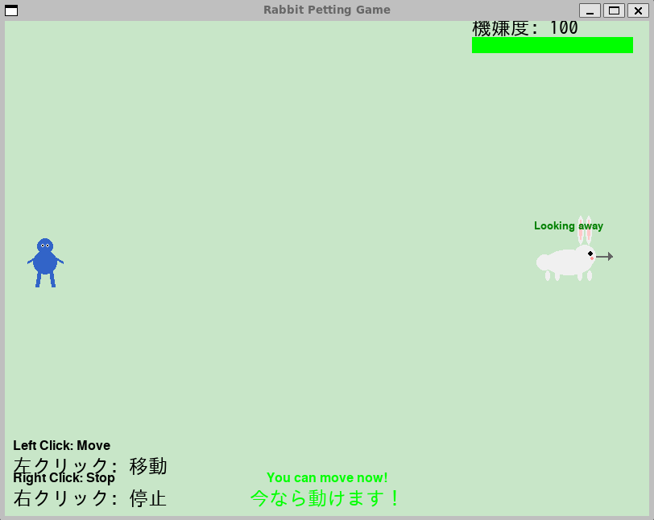

# うさぎを撫でろ！(Nade Usagi)

「うさぎを撫でろ！」は、PyGameで開発されたPC向けゲームです。プレイヤーはうさぎに気づかれないように近づき、撫でることを目指します。「だるまさんがころんだ」の要素を取り入れつつ、うさぎの機嫌度に注意しながらクリアを目指す、シンプルで楽しいゲームです。




## ゲーム概要

- **ゲームの目的**: うさぎに気づかれないように近づき、撫でることに成功する
- **操作方法**:
  - 左クリック: うさぎへ向かって移動
  - 右クリック: 移動を停止
- **勝利条件**: うさぎに十分近づき、撫でることに成功する
- **敗北条件**: うさぎに気づかれすぎて機嫌度が0になる

## インストール方法

### 必要条件

- Python 3.8以上
- pygame 2.5.2

### セットアップ

1. リポジトリをクローン:
```bash
git clone https://github.com/yourusername/nade-usagi.git
cd nade-usagi
```

2. 必要なパッケージをインストール:
```bash
pip install -r requirements.txt
```

## 実行方法

### 通常環境

```bash
python run.py
```

### WSL環境

WSL環境で実行する場合、日本語フォントの問題が発生することがあります。以下の手順で解決できます：

1. 日本語フォントをインストール:
```bash
sudo apt-get update
sudo apt-get install -y fonts-ipafont fonts-noto-cjk
```

2. 付属のスクリプトを使用して実行:
```bash
./run_with_display.sh
```

## ゲームの遊び方

1. タイトル画面でゲームを開始します
2. うさぎが前を向いている間に、左クリックでうさぎに近づきます
3. うさぎが振り返ったら、すぐに右クリックで停止します
4. うさぎに気づかれると機嫌度が減少します
5. うさぎに十分近づいたら、撫でることができます
6. 機嫌度が0になる前にうさぎを撫でることができればクリアです

## 開発者向け情報

- ゲームエンジン: PyGame
- 対応プラットフォーム: Windows, macOS, Linux
- プロジェクト構造:
  - `src/`: ソースコード
  - `assets/`: ゲームアセット（画像、音声など）
  - `run.py`: ゲーム実行スクリプト
  - `run_with_display.sh`: WSL環境用実行スクリプト

## クレジット

- 開発: Amazon Q Developer
